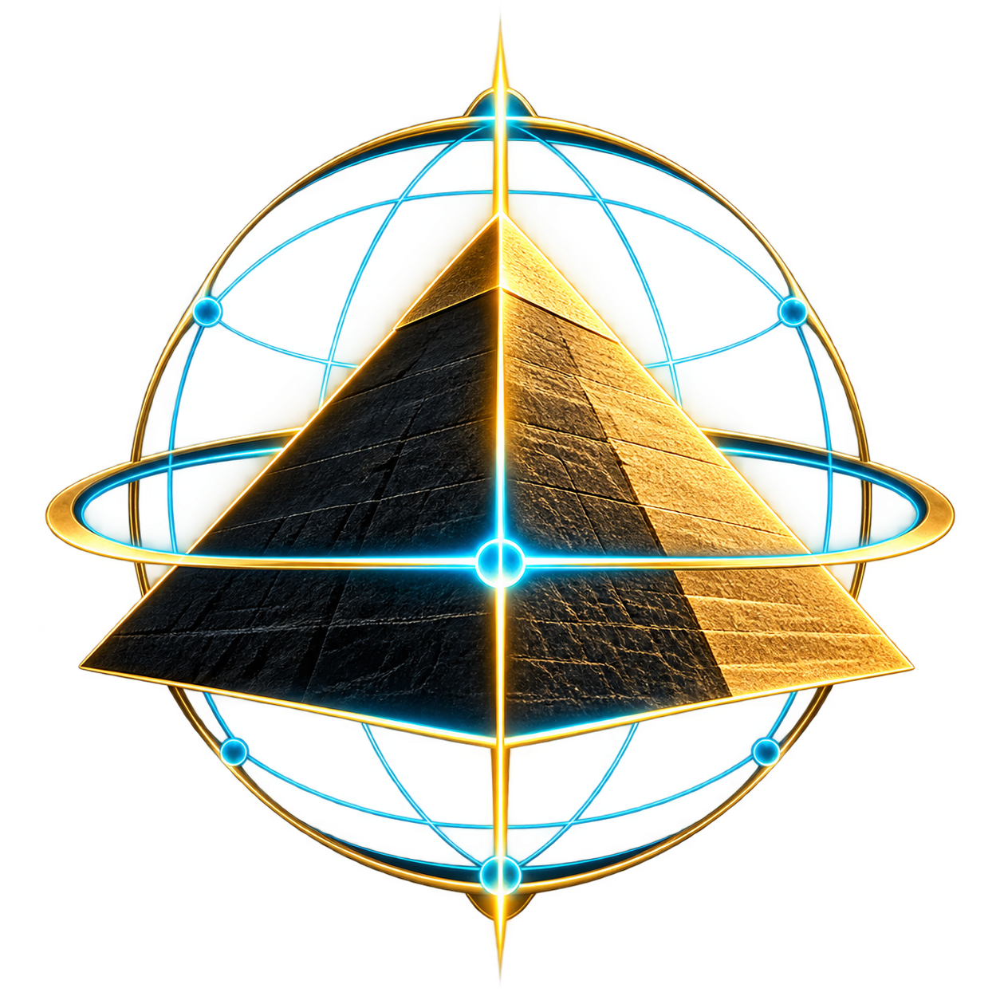

<p align="center">
  
</p>

<h1 align="center">GIZA NEXUS</h1>

<p align="center">
  <strong>Explore ancient structures. Inspect the evidence. Keep every claim accountable.</strong><br>
  A model-first spatial research workstation for the Giza plateau.
</p>

<p align="center">
  <a href="https://github.com/jacksonjp0311-gif/GIZA/actions/workflows/verify.yml"></a>
  <br>
  <strong>0.12.0 · Live Evidence + Human Guidance</strong>
</p>

<p align="center">
  <a href="#get-started">Get started</a> ·
  <a href="#your-first-investigation">First investigation</a> ·
  <a href="#explore-the-workstation">Workspaces</a> ·
  <a href="#understanding-the-evidence">Evidence and limits</a> ·
  <a href="#documentation">Documentation</a>
</p>

## What is GIZA NEXUS?

GIZA NEXUS brings 3-D models, historical sources, measurements and reproducible
research into one local workstation. Begin with a centered view of Khafre's
pyramid, move inside its architectural systems, and inspect individual features
without losing the distinction between what is documented and what is inferred.

The central model is your working surface—not a decorative backdrop. Select a
feature to examine its sources, measure it in a declared coordinate frame,
inspect a section, or investigate a testable question. Save the result with its
original inputs so it can be reopened, compared and challenged later.

**GIZA is a research and interpretation tool, not an archaeological scan or an
automatic discovery engine.** Visual realism does not establish evidence.
Unknown dimensions and unresolved placements remain explicitly unknown.

## Get started

### Requirements

- **Node.js 22** is recommended and used in CI. The package requires Node.js
  20.19 or later.
- A modern browser with WebGL support.
- Git to clone the repository, or a downloaded repository copy.
- An internet connection for the initial dependency installation and external
  source links. The application services run locally.

### Install and launch

From a terminal:

```bash
git clone https://github.com/jacksonjp0311-gif/GIZA.git
cd GIZA
npm ci
npm start
```

Wait for **GIZA READY**, then open **[http://127.0.0.1:4173/](http://127.0.0.1:4173/)**.

Every normal start compiles TypeScript and production assets before launching
the Explorer and Registration Workbench. **Ctrl+C** stops the services started
by the launcher.

After installing dependencies, you can also use:

| Platform | Launcher |
| --- | --- |
| Windows | Double-click `Start-GIZA.cmd`, or run `./Start-GIZA.ps1` in PowerShell |
| macOS / Linux | Run `./start-giza.sh` |
| Any supported platform | Run `npm start` |

**New here? Select Tutorial / ? in the header.** The fifteen-chapter guided tour
highlights real controls, lets you interact with them, and explains the evidence
limits as you go. You can skip chapters, exit at any time, or return through
contextual help.

PDF rendering additionally needs Poppler's `pdfinfo` and `pdftoppm` on PATH.
These tools are not required to explore the model. Historical source PDFs are
not bundled.

## Explore the workstation

| Workspace | What you can do |
| --- | --- |
| **3-D Explorer** | Rotate, zoom and pan around the pyramid; select components; inspect interiors; control model and reality layers. |
| **Quick Views and components** | Focus on a room or object, inspect its context and sources, and use reversible exploded inspection views. |
| **Evidence Assembly** | Examine the Khafre sarcophagus, lid and burial chamber with feature-level evidence, measurements, sections and comparisons. |
| **Map Atlas** | Explore full-workspace maps with filters, zoom, pan and a readable text index. Map context is kept distinct from metric survey control. |
| **Investigations** | Run deterministic comparisons, review candidates, save research and explain whether an earlier result still applies. |
| **Registration Workbench** | Acquire source bytes, freeze controls and holdouts, run the shared fitting engine, inspect residuals, replay and review a scoped revision. |
| **Sphinx** | Inspect an explicitly reconstructed exterior study with isolation, clipping and exploded regions—not a scan or an invented hollow interior. |
| **Inscription Lab** | Inspect Dream Stela imagery, mark reading zones, trace signs and develop a source-linked translation board. |
| **Simulations** | Explore the existing simulation tools and their declared assumptions without promoting simulated output into observed archaeology. |

### Moving around

- **Drag** to rotate, **scroll** to zoom, and **right-drag** to pan in the 3-D viewer.
- **Click** an object or feature to inspect it.
- Use **Fit** and the available view presets to regain your bearings.
- Open **Inspect / layers** for shell removal, dimensions and layer controls.
- Open **Explode** for presentation-only separation; restore the assembled view
  when finished. Spherical masonry expansion is an illustrative display of the
  existing stone cells, not a surveyed stone inventory.
- Use **MAP ATLAS**, **3D MODEL** and **REGISTRATION** to change surfaces.
  Workspaces provide a return route, and tracked unsaved research triggers a
  navigation warning.

Contextual drawers support hover, keyboard focus and touch. The tutorial supports
Tab, Shift+Tab, Enter/Space and Escape, and respects reduced-motion preferences.
Opening or closing help does not give presentation state any physical authority.

## Your first investigation

Start with the focused sarcophagus assembly:

1. **Open Sarcophagus** from Quick Views.
2. **Select a feature.** In Evidence, inspect its exact observations, source
   locators, units, uncertainty and coordinate frame.
3. **Separate support from context.** Direct support, derived dependencies,
   placement dependencies and related context answer different questions.
4. **Open Measure.** Choose a declared frame and use valid anchors or picked
   points. Same-object local dimensions can be usable even when site placement
   is unresolved.
5. **Try Section.** Inspect an orthogonal or oblique cut. A computed cap is a
   reconstructed section surface, not a newly observed archaeological face.
6. **Open Investigate.** Choose an Investigation Candidate and run its
   reproducible computation against identified inputs. A candidate is a question
   requiring review—not a discovery.
7. **Save and export.** Preserve the investigation and keep an exported copy.
8. **Reopen the saved snapshot.** Use Explain / compare inputs to inspect its
   original dependencies and determine whether it remains current.

A relevant input change creates a reason to rerun—not permission to overwrite
the old result. A linked rerun creates a new record. Unrelated camera movement,
tutorial progress or presentation labels must not silently make research stale.

## Understanding the evidence

GIZA separates three reality layers:

| Layer | Meaning |
| --- | --- |
| **OBSERVED** | A directly supported observation within its documented scope. A reported length does not establish surveyed endpoints or an entire observed surface. |
| **RECONSTRUCTED** | Geometry or relationships derived from evidence, with their assumptions and limits retained. |
| **HYPOTHESIS** | Speculative or testable geometry and relationships. Realistic appearance does not increase their authority. |

Observation authority, surface geometry, physical placement, source custody and
review are separate concerns. Selection, camera motion, isolation and explosion
never establish physical coordinates or change canonical dimensions.

**UNKNOWN is not zero.** It identifies missing evidence or an unresolved frame
relationship. For example, local coffer and lid dimensions do not establish a
physical body-to-lid clearance while their connecting placement remains unknown.
Hypothetical transforms cannot produce ordinary authoritative measurements;
explicit conditional calculations retain the assumptions they depend on.

Saved calculations distinguish **CURRENT**, **HISTORICAL** and **UNVERIFIABLE**.
Impact analysis also identifies **UNAFFECTED** research. The explanation shows
which relevant inputs changed, rather than treating general graph reachability
as evidence.

### Live evidence and registration

A trusted session link requires local replay through the existing registration
engine and an explicitly scoped reviewed revision. Imported fields such as
`passed: true` are claims, not proof that GIZA reproduced the result.

The workflow preserves source identity and bytes, hashes, frozen controls,
untouched holdouts, independent-scale classification, residuals, review and
rollback identity. In **Sarcophagus → Compare**, an eligible campaign can be
replayed and linked to the exact assembly snapshot.

**A PLAN_2D relationship remains two-dimensional.** It does not establish
surface topography, lid seating, 3-D chamber placement or site coordinates.
Source hashes establish byte identity, not historical authenticity. Rights and
operator review declarations are not independently authenticated scholarship.

### Current archaeological limits

The real Khafre coffer/chamber campaign remains **BLOCKED** pending:

- A correctly identified plan and permitted-use source bytes.
- Independent local scale/control evidence.
- A declared local datum and uncertainty.
- Distributed frozen controls and untouched holdouts.

Synthetic positive tests demonstrate the software path, not archaeological
completion. Unverified underground geometry is hypothetical and off by default.
Sphinx display geometry is not survey geometry. Inscription Lab does not include
an automatic OCR or translation provider; AI proposal exchange is a manual
handoff, and predicted reconstructions must remain labelled as predictions.

## Saving and protecting your work

Saved investigations preserve archived inputs, canonical points, measurement
frames and linked research records. Presentation state stays separate.

Browser-local storage is convenient, but **it is not an archival backup or a
multi-user database**. Export important investigations and Inscription Lab
drafts. Keep original source assets, frozen experiments and receipts intact.
Do not clear browser data before exporting work you need to retain.

The local workbench binds to `127.0.0.1`; mutation endpoints require a
session token and an allowed origin. External source links and media may still
require network access. Do not publish private research assets or assume that
a source image's inclusion grants unrestricted reuse.

## Troubleshooting

| Problem | What to do |
| --- | --- |
| Dependencies or compilation fail | Confirm the supported Node version, run `npm ci`, then retry `npm start`. The launcher does not start new services after a failed compilation. |
| A port is occupied | Stop your existing GIZA instance, or choose different `GIZA_EXPLORER_PORT` and `GIZA_PORT` values. The launcher will not kill an unrelated process. |
| The 3-D view is blank | Check browser WebGL/hardware-acceleration support and the browser console. Export any accessible draft before clearing application data. |
| An optional map or research dataset is unavailable | Read the scoped error and retry. Optional data should not prevent the core model from opening. |
| Measurement returns UNKNOWN | Inspect the declared frame, geometry and missing evidence. Do not substitute a display pose for an unresolved physical transform. |
| A campaign will not link | Use the normal launcher, inspect replay/review errors, and verify the campaign belongs to the current assembly snapshot. Rolled-back revisions cannot activate live evidence. |
| PDF rendering fails | Confirm `pdfinfo` and `pdftoppm` are installed and on PATH. Preserve the original source bytes. |

## Development and verification

The application uses **React, TypeScript, Three.js / React Three Fiber and Vite**,
with a local Node.js registration workbench.

```bash
npm ci
npm run dev                 # Explorer development server
npm run workbench           # Workbench in a second terminal
```

Useful checks:

```bash
npm run check               # Contracts, validators, TypeScript and workbench checks
npm run build               # Production compilation
npx playwright install chromium
npm run test:browser         # Actual rendered interaction tests
npm start -- --smoke         # Compile, start both services, check readiness, stop
npm run verify:release       # Check current sealed manifests
```

Free the default ports before running the smoke check, or configure alternate
ports. `npm start -- --check` compiles without serving.

The 0.12.0 implementation at
[`bb87093`](https://github.com/jacksonjp0311-gif/GIZA/commit/bb8709381e5efb533505c7a2ef4e0c35c171f66b)
passed the complete [Ubuntu and Windows verification run](https://github.com/jacksonjp0311-gif/GIZA/actions/runs/35378635731):
both verification jobs and all ten browser groups. Local verification recorded
201 contract tests and 31 browser tests. These are dated software results—not
evidence of archaeological accuracy or a claim about an untested future commit.

The badge above reports the latest workflow status.
[VALIDATION.md](VALIDATION.md) retains successful checkpoints, earlier failures,
environment details and measurement limitations.

When contributing, keep changes focused, add regressions, preserve historical
receipts and do not weaken evidence gates to obtain a passing result. Read
[AGENTS.md](AGENTS.md) and the relevant contracts first. Follow the repository's
release policy: update documentation, regenerate manifests only after final
changes, then verify the seal. Public visibility does not by itself grant reuse
rights; consult individual source credits and obtain permission where needed.

## Documentation

| Start here | Reference |
| --- | --- |
| Guided learning and accessibility | [Tutorial Mode](docs/TUTORIAL_MODE.md) |
| Feature, frame and measurement contracts | [Evidence Assembly](docs/EVIDENCE_ASSEMBLY.md) |
| Replay, live relations, impact and rollback | [Live Evidence Integration](docs/LIVE_EVIDENCE_INTEGRATION.md) |
| Source-to-result workflow and real blockers | [Source Campaign](docs/SOURCE_CAMPAIGN.md) |
| Registration tools | [Registration Workbench](docs/REGISTRATION_WORKBENCH.md) |
| Interior inspection and inscription workflows | [Interiors and Epigraphy](docs/INTERIORS_AND_EPIGRAPHY.md) |
| Sphinx reconstruction limits | [Sphinx Explorer](docs/SPHINX_EXPLORER.md) |
| Atlas and exploded presentation | [Atlas and Spatial Presentation](docs/ATLAS_SPATIAL_PRESENTATION.md) |
| Image audit, credits and reproduction distinctions | [Media and Orbit Cleanup](docs/MEDIA_ORBIT_CLEANUP.md) |
| Release history and executed checks | [Changelog](CHANGELOG.md) · [Validation](VALIDATION.md) |
| Technical continuation | [Continuity](CONTINUITY.json) |

Earlier handoff prose is preserved in the
[README snapshot before this human-focused rewrite](docs/history/README-2026-09-18.md).
It records historical implementation states; use the current README and dated
verification records for today's entry points.

---

**Explore freely. Inspect the evidence. Run reproducible tests. Keep hypothesis
separate from observation.**
